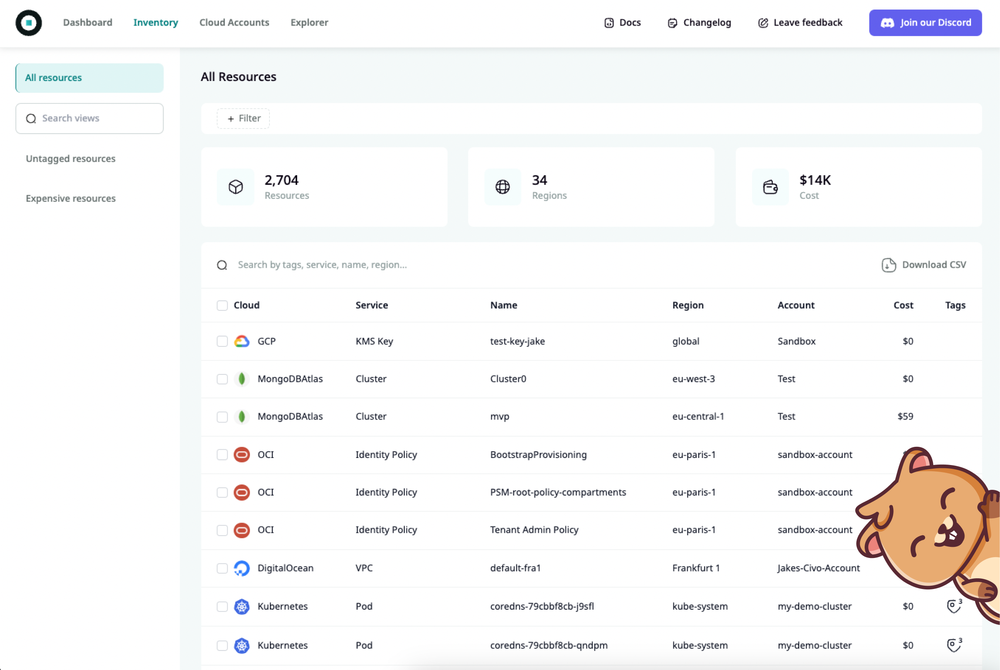

<h1 align="center"><a href="https://www.producthunt.com/posts/komiser-2" target="_blank"></a></h1>

Komiser is an open-source cloud-agnostic resource manager designed to analyze and manage cloud cost, usage, security, and governance all in one place. It integrates seamlessly with multiple cloud providers, including AWS, Azure, Civo, Digital Ocean, OCI, Linode, Tencent, Scaleway and [more](#supported-cloud-providers). Interested? read more about Komiser on our [website](https://komiser.io?utm_source=github&utm_medium=social).

If you’re using Komiser or if you like the project, please ⭐ this repository to show your support! 🤩

<p align="center">
    
<a href="https://discord.tailwarden.com">

</a>

<a href="https://github.com/tailwarden/komiser/releases">

</a>

<a href="https://hub.docker.com/r/mlabouardy/komiser">

</a>

</p>

<p align="center"></p>

<h4 align="center">
    <a href="https://cloud.tailwarden.com?utm_source=github&utm_medium=social">Tailwarden Cloud</a> |
    <a href="https://docs.komiser.io/docs/introduction/getting-started?utm_source=github&utm_medium=social/">Guide</a> |
    <a href="https://docs.komiser.io/docs/guides/overview?utm_source=github&utm_medium=social">How to Komiser</a> |
    <a href="https://docs.komiser.io/docs/events">Community Events</a><br/><br/>
    <a href="https://docs.komiser.io/docs/contributing/contribute?utm_source=github&utm_medium=social">Contribute</a> | 
    <a href="https://roadmap.tailwarden.com">Roadmap</a><br/><br/>
</h4>

<!-- START doctoc generated TOC please keep comment here to allow auto update -->
<!-- DON'T EDIT THIS SECTION, INSTEAD RE-RUN doctoc TO UPDATE -->
**Table of Contents**

- [](#)
  - [What is Komiser? 🤷](#what-is-komiser-)
  - [Who is using it?](#who-is-using-it)
  - [Getting started](#getting-started)
    - [Installation](#installation)
      - [Tailwarden Cloud (Free & Recommended)](#tailwarden-cloud-free--recommended)
      - [Linux](#linux)
      - [Windows](#windows)
      - [Mac OS X](#mac-os-x)
      - [Homebrew](#homebrew)
    - [Configuration](#configuration)
  - [Resources 📖](#resources-)
  - [Bugs and feature requests 🐞](#bugs-and-feature-requests-)
  - [Roadmap and Contributing 🛣️](#roadmap-and-contributing-)
  - [Users 🧑‍🤝‍🧑](#users-)
  - [Contributors](#contributors)
  - [Versioning 🧮](#versioning-)
  - [License](#license)

<!-- END doctoc generated TOC please keep comment here to allow auto update -->

## What is Komiser? 🤷
Komiser is an open source project created to **analyse** and **manage cloud cost**, **usage**, **security** and **governance** all in one place. With komiser you can also: 
* Build an inventory of your cloud infrastructure assets.
* Control your **resource usage** and gain visibility across all used services to achieve maximum cost-effectiveness.
* Detect **potential vulnerabilities** that could put your cloud environment at risk.
* Get a deep understanding of **how you spend** on the AWS, Azure, GCP, Civo, DigitalOcean and OCI.
* Uncover idle and untagged resources, ensuring that no resource goes unnoticed.

<h1 align="center"></h1>

## Who is using it?
Komiser was built with every Cloud Engineer, Developer, DevOps engineer and SRE in mind. We understand that tackling cost savings, security improvements and resource usage analyse efforts can be hard, sometimes just knowing where to start, can be the most challenging part at times. Komiser is here to help those cloud practitioners see their cloud resources and accounts much more clearly. Only with clear insight can timely and efficient actions take place.

## Getting started

### Installation

#### Tailwarden Cloud (Free & Recommended)

Head over to [Tailwarden](https://cloud.tailwarden.com?utm_source=github&utm_medium=social&utm_campaign=readme).

#### Linux

```
wget https://cli.komiser.io/latest/komiser_Linux_x86_64 -O komiser
```

#### Windows

```
wget https://cli.komiser.io/latest/komiser_Windows_x86_64.zip
tar -xf komiser_Windows_x86_64.zip
```

#### Mac OS X

ARM architecture (M1 & M2 Chip)
```
wget https://cli.komiser.io/latest/komiser_Darwin_arm64 -O komiser
```

AMD architecture (Intel Chip)
```
wget https://cli.komiser.io/latest/komiser_Darwin_x86_64 -O komiser
```

#### Homebrew
```
brew update
brew tap tailwarden/komiser
brew install komiser

# Make sure you are running the newest version of Komiser:
brew update
brew reinstall komiser
```

### Configuration

| Providers                                                                                                          | Documentation                                                                                                                                                    | Video |
| ------------------------------------------------------------------------------------------------------------------------------ | ---------------------------------------------------------------------------------------------------------------------------------------------------------------- | ---- |
| [](https://docs.komiser.io/configuration/cloud-providers/k8s?utm_source=github&utm_medium=social&utm_campaign=readme)        | [Kubernetes documentation link](https://docs.komiser.io/configuration/cloud-providers/k8s?utm_source=github&utm_medium=social&utm_campaign=readme) | [Komiser + k8s](https://youtu.be/hSiVFjD0u3I) |
| [](https://docs.komiser.io/configuration/cloud-providers/aws?utm_source=github&utm_medium=social&utm_campaign=readme)                      | [AWS documentation link ](https://docs.komiser.io/configuration/cloud-providers/aws?utm_source=github&utm_medium=social&utm_campaign=readme)           | [Komiser + AWS EKS](https://youtu.be/4veDmJpui44) |
| [](https://docs.komiser.io/configuration/cloud-providers/azure?utm_source=github&utm_medium=social&utm_campaign=readme)        | [Azure documentation link](https://docs.komiser.io/configuration/cloud-providers/azure?utm_source=github&utm_medium=social&utm_campaign=readme) | |
| [](https://docs.komiser.io/configuration/cloud-providers/civo?utm_source=github&utm_medium=social&utm_campaign=readme)                      | [Civo documentation link](https://docs.komiser.io/configuration/cloud-providers/civo?utm_source=github&utm_medium=social&utm_campaign=readme)           | [Komiser + Civo](https://youtu.be/NBbEpoW-kVs) |
| [](https://docs.komiser.io/configuration/cloud-providers/digital-ocean?utm_source=github&utm_medium=social&utm_campaign=readme)        | [Digital Ocean documentation link](https://docs.komiser.io/configuration/cloud-providers/digital-ocean?utm_source=github&utm_medium=social&utm_campaign=readme) | |
| [](https://docs.komiser.io/configuration/cloud-providers/linode?utm_source=github&utm_medium=social&utm_campaign=readme)                      | [Akamai (Linode) documentation link](https://docs.komiser.io/configuration/cloud-providers/linode?utm_source=github&utm_medium=social&utm_campaign=readme)           | |
| [](https://docs.komiser.io/docs/cloud-providers/google-cloud-platform?utm_source=github&utm_medium=social&utm_campaign=readme)                      | [GCP documentation link](https://docs.komiser.io/docs/cloud-providers/google-cloud-platform?utm_source=github&utm_medium=social&utm_campaign=readme)           | |
| [](https://docs.komiser.io/configuration/cloud-providers/oracle?utm_source=github&utm_medium=social&utm_campaign=readme)        | [Oracle Cloud Infrastructure documentation link](https://docs.komiser.io/configuration/cloud-providers/oracle?utm_source=github&utm_medium=social&utm_campaign=readme) | |
| [](https://docs.komiser.io/configuration/cloud-providers/linode?utm_source=github&utm_medium=social&utm_campaign=readme)                      | [Tencent Cloud documentation link](https://docs.komiser.io/configuration/cloud-providers/linode?utm_source=github&utm_medium=social&utm_campaign=readme)           | |
| [](https://docs.komiser.io/docs/cloud-providers/scaleway?utm_source=github&utm_medium=social&utm_campaign=readme)        | [Scaleway documentation link](https://docs.komiser.io/docs/cloud-providers/scaleway?utm_source=github&utm_medium=social&utm_campaign=readme) | |
| [](https://docs.komiser.io/configuration/cloud-providers/linode?utm_source=github&utm_medium=social&utm_campaign=readme)                      | [MongoDB Atlas documentation link](https://docs.komiser.io/configuration/cloud-providers/linode?utm_source=github&utm_medium=social&utm_campaign=readme)           | |


## Resources 📖

* [Documentation](https://docs.komiser.io?utm_source=github&utm_medium=social)
* [Videos](https://www.youtube.com/@tailwarden/videos)
* [Blog](https://www.tailwarden.com/blog)


## Bugs and feature requests 🐞

Have a bug or a feature request? Please first read the issue guidelines and search for existing and closed issues. If your problem or idea is not addressed yet, [please open a new issue](https://github.com/tailwarden/komiser/issues).

## Roadmap and Contributing 🛣️

We are very excited about what is in store in the coming weeks and months, take a look at the [public roadmap](https://roadmap.tailwarden.com/) to stay on top of what's coming down the pipeline. 

Komiser is written in `Golang` and is `Elv2 licensed` - contributions are always welcome whether that means providing feedback through GitHub, through the `#feedback` channel on our [Discord server](https://discord.tailwarden.com), testing existing features or suggesting new ones. Feel free to check out our [contributor guidelines](./CONTRIBUTING.md) and consider becoming a **contributor** today. 

Learn how to contribute with these walkthrough videos:

- [How to contribute to Komiser engine](https://www.youtube.com/watch?v=Vn5uc2elcVg)
- [How to contribute to Komiser dashboard](https://www.youtube.com/watch?v=uwxj11-eRt8)

## Users 🧑‍🤝‍🧑

If you'd like to have your company represented and are using `Komiser` please give formal written permission below via email to contact@tailwarden.com.

We will need a URL to an SVG or png logo, a text title, and a company URL.

## Contributors

<a href="https://github.com/tailwarden/komiser/graphs/contributors">
  
</a>

## Versioning 🧮

We use [SemVer](http://semver.org/) for versioning. For the versions available, see the [tags on this repository](https://github.com/tailwarden/komiser/tags). 

## License

Komiser is licensed under the terms of [Elastic License 2.0 (ELv2)](https://github.com/tailwarden/komiser/blob/release/LICENSE).
