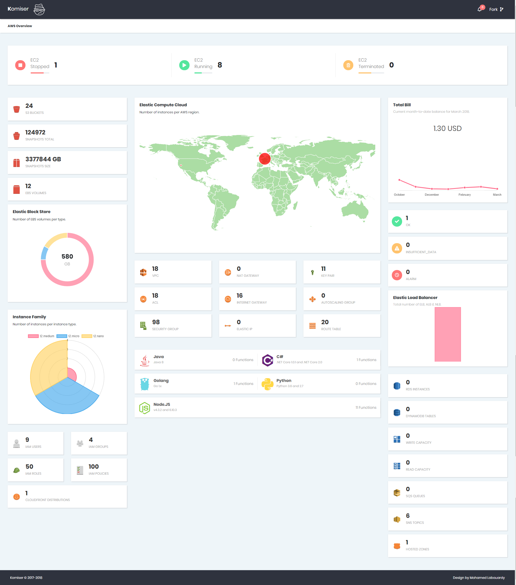

<p align="center">
    
</p>

[](https://hub.docker.com/r/mlabouardy/komiser/) 
[](LICENSE) [](https://circleci.com/gh/mlabouardy/komiser/tree/master) [](https://goreportcard.com/report/github.com/mlabouardy/komiser) [](https://github.com/mlabouardy/komiser/issues)  


## Download

Below are the available downloads for the latest version of Komiser (1.0.0). Please download the proper package for your operating system and architecture.

### Linux:

```
wget https://s3.us-east-1.amazonaws.com/komiser/1.0.0/linux/komiser
```

### Windows:

```
wget https://s3.us-east-1.amazonaws.com/komiser/1.0.0/windows/komiser
```

### Mac OS X:

```
wget https://s3.us-east-1.amazonaws.com/komiser/1.0.0/osx/komiser
```

## How to use

* Create an IAM user with the following IAM [policy](https://raw.githubusercontent.com/mlabouardy/komiser/master/policy.json):

```
wget https://s3.amazonaws.com/komiser/policy.json
```

* Add your **Access Key ID** and **Secret Access Key** to *~/.aws/credentials* using this format

``` 
[default]
aws_access_key_id = <access key id>
aws_secret_access_key = <secret access key>
region = us-east-1
```

* That should be it. Try out the following from your command prompt to start the server:

```
komiser start --port 3000 --duration 30
```

(You may need to `chmod +x komiser` on OSX after downloading.)

* Point your browser to http://localhost:3000

<p align="center">
    
</p>

## Docker

Use the official Komiser image:

```
docker run -d -p 3000:3000 -e AWS_ACCESS_KEY_ID="" -e AWS_SECRET_ACCESS_KEY="" -e AWS_DEFAULT_REGION="" --name komiser mlabouardy/komiser
```

### Environment Variables

| Environment Variable | Description |
| -------------------- | ----------- |
| PORT | Server Port |
| DURATION | Server Cache Expiration (minutes) |
| AWS_ACCESS_KEY_ID | AWS Access Key |
| AWS_SECRET_ACCESS_KEY | AWS Secret Key |
| AWS_DEFAULT_REGION | AWS Region |
| AWS_PROFILE | AWS Profile ([Docs](https://docs.aws.amazon.com/sdk-for-go/v1/developer-guide/configuring-sdk.html)) |

## Configuring Credentials

When using the CLI you'll generally need your AWS credentials to authenticate with AWS services. Komiser supports multiple methods of supporting these credentials. By default the CLI will source credentials automatically from its default credential chain.

* Environment Credentials - Set of environment variables that are useful when sub processes are created for specific roles.

* Shared Credentials file (~/.aws/credentials) - This file stores your credentials based on a profile name and is useful for local development.

* EC2 Instance Role Credentials - Use EC2 Instance Role to assign credentials to application running on an EC2 instance. This removes the need to manage credential files in production.

## Supported AWS Services

* EC2
* EBS
* Snapshots
* Security Groups
* Access Control Lists
* Autoscalling groups
* ELB
* VPC
* Key Pairs
* Nat Gateway
* Internet Gateway
* Elastic IP
* Route Table
* Billing
* Lambda Functions
* RDS
* DynamoDB
* S3
* Route53
* SQS
* SNS
* IAM
* CloudWatch Alarms
* CloudFront Distributions
* ECS

## TO DO

* EMR
* Kinesis
* Elastic Beanstalk
* Glacier
* EFS

## Maintainers

* Mohamed Labouardy

## Discussion

Join us on Slack: https://komiser.slack.com

## Tutorial

* [Komiser: AWS Environment Inspector](http://www.blog.labouardy.com/komiser-aws-environment-inspector/)

## License

MIT
